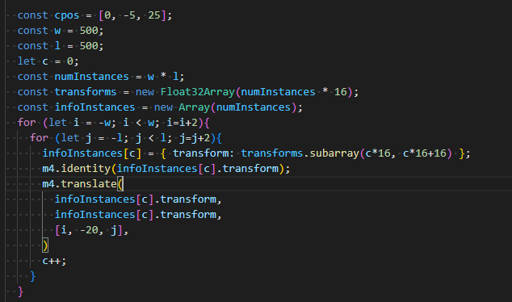
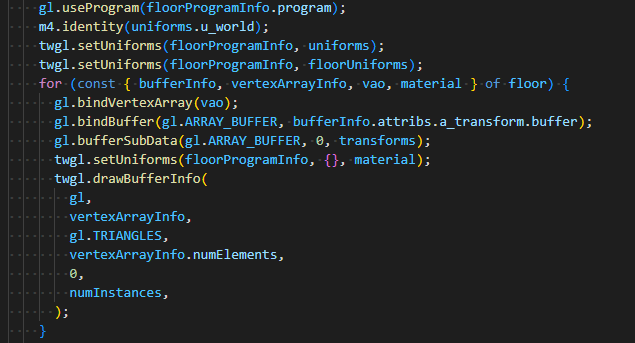
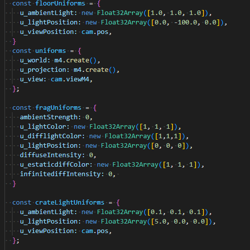

# Introducción
Para el trabajo final del curso de Computación Gráfica, se nos pidió añadir nuevas técnicas de computación gráfica, como iluminación e instanciamiento, a nuestro trabajo parcial. El trabajo fue desarrollado en el lenguaje Java Script y su avance fue subido al presente repositorio de Git.

# Objetivos
- Aplicar los tipos de iluminación que se han empleado en el transcurso del curso de manera efectiva y configurable mediante sliders implementados en HTML.
- Evidenciar que el desarrollo del instanciamiento es considerablemente viable a comparación de la implementación de objetos que se desarrollaron en la primera parte del curso.
- Mediante una presentación en video, argumentar el uso de algoritmos de iluminación y la viabilidad del instanciamiento.

# Problema/ Caso desarrollado
Complementar el proyecto presentado en el trabajo parcial, incluyendo todos los tipos de iluminación e instanciamiento.

# Descripción de la solución propuesta
- El suelo fue instanciado con 250,000 instancias. 500 x 500 .
- Se cuenta con tres objetos, dos de ellos tienen iluminación ambiental y difusa controlada por sliders; y el otro iluminación especular a través de un mapa especular.
- Se cuenta con mivimiento total de la camara.
- Se aplicaron un total de 4 programas diferentes. Cada uno con sus respectivos vert y frags.

# Desarrollo 
-Algoritmo de instanciamiento

 
 
-Implementación de la iluminación de los objetos

-Controladores de la iluminación

  
 

# Conclusiones
- El instanciamiento permite mostrar gran cantidad de objetos con mucho mejor rendimiento. Esto fue demostrado en nuestro proyecto, que siempre mantuvo un tasa de frames aceptable, a pesar de contar con 250,000 objetos.
- Cada objeto cuenta con su propia iluminación, por lo que la luz ambiental es una simple simulación en realidad.
- El trabajo fue desarrollado con éxito, incluyendo todo lo asignado y sin problemas de código.
